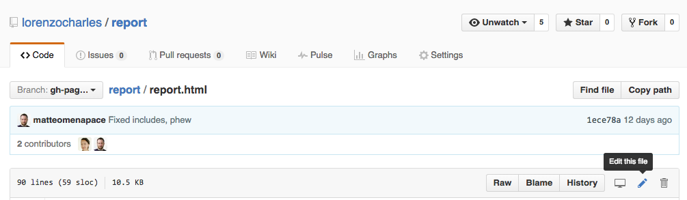

# Main structure

All pages are `.html` files stored in the main folder at https://github.com/lorenzocharles/report

* `index.html` is the main file - Foreword
* `summary.html` is Summary
* `report.html` is Report > Background
* `report.narrative.html` is Report > Main Narrative
  * `_includes/report.narrative.1.html` is Report > Narrative > Introduction
  * `_includes/report.narrative.2.html` is Report > Narrative > Mare Nostrum's Demise
  * etc.

## Making changes

1. Right-click on a `.html` file from the list above, e.g. `report.html`, and then `Open Link in New Tab`
* In the new tab, click on the *pencil* button on the top-right to start editing that file
  
* Use <kbd>cmd</kbd> + <kbd>F</kbd> to search for the word / sentence you want to change
* Make your changes to the content
* When you're done, scroll down to the bottom of the page and the press the green `Commit changes` button

### Changing images

Images are inside blocks that look like this

```ruby

```
You can change the text for `caption`, by editing the bit between `caption='` and `'`. Make sure there are no single quotes `'` in that text, otherwise the image code will break. 


* if you want to change an image look for `<div class="img-box fit"`
* find the image url and change the name in `<a href='{{ site.baseurl}}/assets/CHANGE-THIS-NAME.jpg'>` AND ``
* Write a commit message and press commit button

###  Changing footnotes

* You're looking for `<sup ... data-content="CHANGE THIS" ...>...</sup>` 
* We recommend using `www.html-cleaner.com`
* In HTML Cleaner, paste in your content from the Word doc
* Press Clean HTML under the HTML screen on the left
* If you want to use a footnote, navigate to the bottom of the HTML where you'll find links to the footnotes that look something like: `<p><a>something or other [8]</a> Footnotes content here </p>`
* If there are links in the footnote be sure to replace all double quotation marks `"` with single `'`
* Then copy only the text which you want to appear in the flag
* In the document on Github, paste the footnote text into the `<sup ...datacontent="PASTE-HERE" ...>...</sup>`
* When you're happy with the changes, write a commit message and press commit
